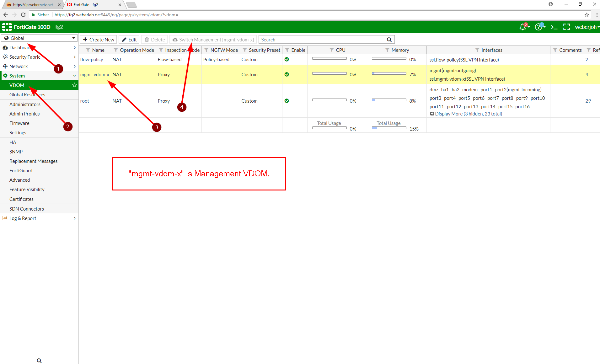
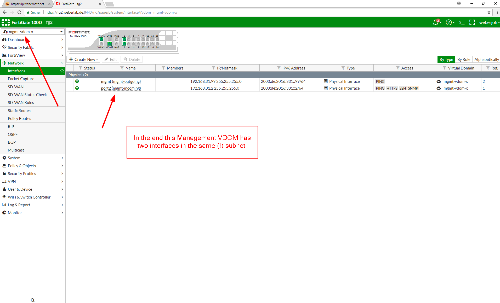
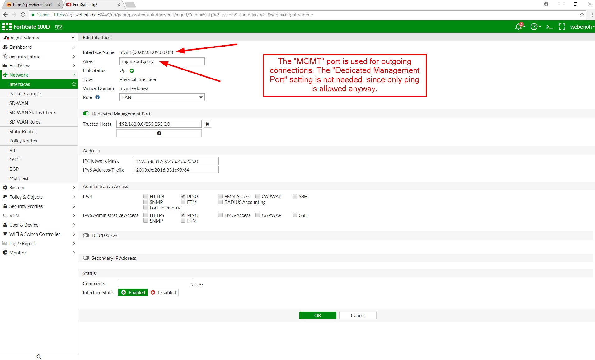
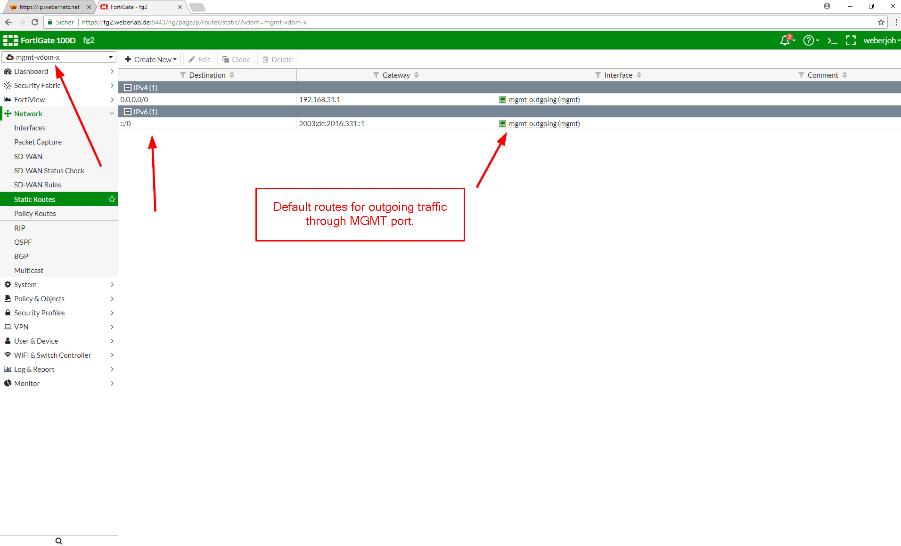
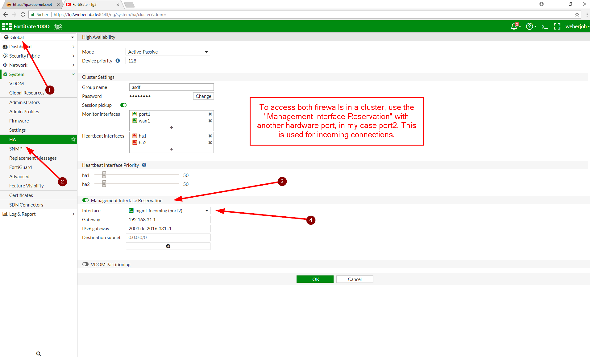

FortiGate Out-of-Band Management
================================

In some situations you want to manage your firewall only from a dedicated management network and not through any of the data interfaces. For example, when you're running an internal data center with no Internet access at all but your firewalls must still be able to get updates from the Internet. In those situations **you need a real out-of-band (OoB) management interface from which all management traffic (DNS, NTP, Syslog, Updates, RADIUS, ...) is sourced and to which the admins can connect to via SSH/HTTPS**. Another example is a distinct separation of data and management traffic. For example, some customers want any kind of management traffic to traverse through some other routing/firewall devices than their production traffic.

Unfortunately the **Fortinet FortiGate firewalls don't have a reasonable management port**. Their so-called "MGMT" port is only able to limit the access of *incoming* traffic but is not able to *source* outgoing traffic by default. Furthermore, in an HA environment you need multiple ports to access the firewalls independently. What a mess. (Little exception: You can use the  set ha-direct enable option in the HA setup which sources *some* but not all protocols from the Mgmt interface. But only when you're using a HA scenario. [Reference](https://help.fortinet.com/fos50hlp/54/Content/FortiOS/fortigate-high-availability-52/HA_operatingReservedMg.htm).)

**A functional workaround is to add another VDOM solely for management.** From this VDOM, all management traffic is sourced. To have access to all firewalls in a high availability environment, a second (!) interface within this management VDOM is necessary. Here we go:

An out-of-band management is a **completely separated management plane** with its own interface and default route FROM which all management traffic is sourced solely and TO which all admin accesses are destined. A data interface that is part of the normal routing process and only limits incoming connections from "management stations" is NOT an out-of-band management.

Note that there are other firewalls that implement that kind of OoB management such as the **firewalls from Palo Alto Networks with their real dedicated management plane**with its own interface and default route. This is a really good example of a clearly separated management and data plane. Don't know why Fortinet isn't able to do it the same way.

From my point of view it's really stupid to call a port "MGMT" and to even have multiple "Dedicated Management Port" and "Management Interface Reservation" options when those possibilities are not well designed at all.


-   **Enable virtual domains** and create another VDOM for your management. I called it "mgmt-vdom-x" just to have it distinguishable.
-   Select this VDOM as your **management VDOM**, e.g., by clicking the "Switch Management" button in the GUI at Global -> System -> VDOM.
-   **Move the MGMT port to this management-VDOM** and select "Dedicated Management Port" (just for fun, you don't need it here). Configure static default routes for both Internet protocols. From now on, all outgoing connections from the FortiGate are sourced from this interface. Good so far.
-   If you want to access both firewalls in an HA environment independently you cannot use this MGMT port for incoming connections (SSH/HTTPS/...). What a shit. Hence:
-   **Move a second port to this management-VDOM and within the HA section select it as "Management Interface Reservation"** with appropriate route statements. I used "port2" for this.
-   **Configure different IP addresses** (within the same prefix/subnet) on that second port on all involved firewalls.

To sum it up:

1.  The MGMT port is now used by the firewall for *outgoing* connections.
2.  The second port with different IP addresses on all firewalls is used by the admins to connect *to* those firewalls via SSH/HTTPS/SNMP.

Guide
-----

To get an idea I have a couple of **screenshots** and listings for you. As always, it is crappy to configure FortiGate firewalls because the GUI does not show everything (such as IPv6 related configs) while the CLI is completely crowded with unused commands. I am using a **FG-100D with ****FortiOS v5.6.4** build1575 (GA). My prefix/subnet for the management VDOM is 2003:de:2016:331::/64 and [192.168.31.0](http://192.168.31.0/)/24. The internal default router (not on the FortiGate but in the upstreaming data center) has the ::1 and .1 IP addresses.



Management VDOM



Interface



MGMT Port outgoing



Default Routes



Management Interface Reservation


Different IP addresses on both firewalls


Interface Overview

And here are those **code snippets from the CLI**. Note that port2 has the set vdom "root" command shown, which seems to be the way FortiGate handles the port that is used for "Management Interface Reservation" in the HA section.


```
config global

config system interface

    edit  "mgmt"

        set vdom  "mgmt-vdom-x"

        set ip  [192.168.31.99](http://192.168.31.99/)  [255.255.255.0](http://255.255.255.0/)

        set allowaccess ping

        set type  physical

        set dedicated-to  management

        set alias  "mgmt-outgoing"

        set role lan

        set snmp-index  6

        config ipv6

            set ip6-address  2003:de:2016:331::99/64

            set ip6-allowaccess ping

        end

        set trust-ip-1  [192.168.0.0](http://192.168.0.0/)  [255.255.0.0](http://255.255.0.0/)

        set trust-ip6-1  2003:de:2016::/48

    next

    edit  "port2"

        set vdom  "root"

        set ip  [192.168.31.2](http://192.168.31.2/)  [255.255.255.0](http://255.255.255.0/)

        set allowaccess ping https ssh snmp

        set type  physical

        set alias  "mgmt-incoming"

        set role lan

        set snmp-index  24

        config ipv6

            set ip6-address  2003:de:2016:331::2/64

            set ip6-allowaccess ping https ssh snmp

        end

    next

end

config system global

    set management-vdom  "mgmt-vdom-x"

end

config system ha

    set group-name  "asdf"

    set mode  a-p

    set password ENC  8GWuqnIdx7kLSgMaTdRerkMzOy359WwZEPiPaf9U7yzpxi6P0eDStIfX+tNgeclE+Wf+X6mj4k7o/Mofi3Ta1B/j9TKRQ1rUCq7ABTYAnCpLK6LVzhQMXOH9EPPnKzuwYR9PrbMpyp2x25aqW3JQaFu2rm6GK/QVZzMzcV0acpgmTFAvsyWdazQcCrQM8FGBiSyuxA==

    set session-pickup enable

    set ha-mgmt-status enable

    config ha-mgmt-interfaces

        edit  1

            set interface  "port2"

            set gateway  [192.168.31.1](http://192.168.31.1/)

            set gateway6  2003:de:2016:331::1

        next

    end

    set override disable

    set monitor  "port1"  "wan1"

end

end

config vdom

edit mgmt-vdom-x

config router static

    edit  1

        set gateway  [192.168.31.1](http://192.168.31.1/)

        set device  "mgmt"

    next

end

config router static6

    edit  1

        set gateway  2003:de:2016:331::1

        set device  "mgmt"

    next

end

end

```

